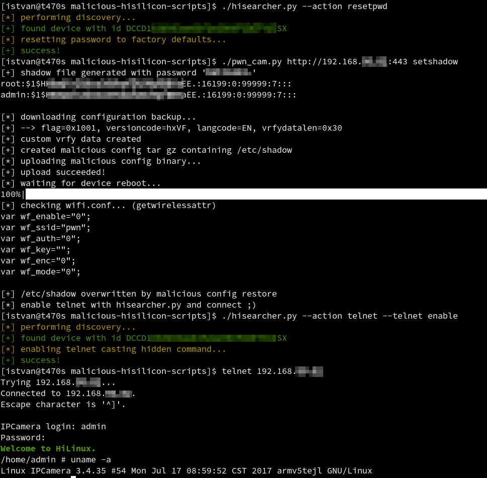

# malicious-hisilicon-scripts

Materials from my older (2018) HiSilicon research.

> When I watched the fantastic research talk from
> [@PaulMarrapese](https://twitter.com/PaulMarrapese) at
> [#defcon28](https://twitter.com/search?q=%23defcon28&src=typeahead_click),
> just realized that I have some older, related, but unreleased stuff
> about IP cameras with HiSilicon firmware.

Here are some of my older scripts.

WARNING: these are intended for research use only, do not
use it in production environment without prior testing, it could
cause damage to the firmware.

* [hisearcher.py](./hisearcher.py): issuing commands through multicast packets
  * Discover IP cameras on current LAN.
  * Reset password (unauthenticated). It is registered as a critical CVE
  ([CVE-2020-9529](https://github.com/pmarrapese/iot/tree/master/exploits/cve-2020-9529)) now by [@PaulMarrapese](https://twitter.com/PaulMarrapese)
  * Enable/Disable Telnet by the hidden backdoor command `printscreen` ;)

* [pwn_cam.py](./pwn_cam.py): RCE by uploading malicious (wifi.conf) configuration. Please be careful, it could harm the device. Supported functions by the script:
  * read /etc/shadow
  * update /etc/shadow (useful for accessing the device by telnet because the factory default root password is still unknown)
  * restore /etc/shadow to factory default (hardcoded in the script)

The scripts were used and tested only on my
[EM6360 CamLine Pro HD Dome IP camera](https://support.eminent-online.com/hc/en-us/articles/360008447799-EM6360-Download-Firmware-Software-)
with the R1 firmware version V11.4.4.4.5-20170830.

Below is a demo run:

1. resetting password (unauthenticated, that is without knowing the current one)
2. setting our predefined root password in the OS (by exploiting RCE)
3. enabling telnet by issuing the hidden backdoor command
4. arbitrary RCE in the OS through the telnet interface as root

